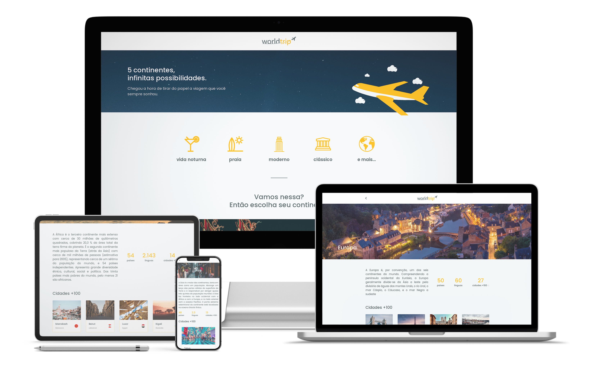

# WorldTrip ✈


## 👽 Sobre o projeto
Projeto desenvolvido em um desafio do Bootcamp da @Rocketseat para exibir as cidades mais visitadas do mundo - Interface desenvolvida em [Chakra UI](https://chakra-ui.com/).

<br />

### 🤖 Instruções
- [Esquemático do desafio](https://www.notion.so/Desafio-01-Interface-com-Chakra-UI-d1274f7fd7f54283b9173b7fd8003cc6#6936def9866b4ef394c9420251300639)

<br />

### 💥 Acessando o layout do projeto:
- [Desafio 1 Módulo IV React](https://www.figma.com/file/8QAkMs3BddatXn2fFseyu4/Desafio-1-M%C3%B3dulo-4-ReactJS/duplicate)

## 🎛 Funcionalidades
- Integração com Prismic CMS como back-end - conceito de [JAMStack](https://jamstack.org/)

- Sistema usado para os carregamento das páginas em getStaticProps` do [Next.js](https://nextjs.org/) seguindo o exemplo de aulas anteriores.


- Country: Key Text


Nota: _Integração com Prismic CMS (seguindo o exemplo do [Gabriel Borges](https://github.com/GBDev13/worldtrip)._

<br />

---
<br />

## 👨‍🏫 Como usar o Prismic neste projeto
- Acesse o [Prismic.oi]() e crie uma conta, se caso ainda não tenha uma ou faça o login em sua conta.
- Crie um novo Custom Type com o nome `continent` (este nome não é opcional caso vá usar este projeto como está).
- Use a estrutura abaixo do <strong>Modelo do Custom Types</strong>
- - slug: UID
- - Title: Key Text
- - Summary: Key Text
- - Description: Rich Text
- - Slider: Image
- - Banner: Image
- - Country: Number
- - Languages: Number
- - Cities: Number
- - City List: Key Text
- - Cities100: Group
- - Thumbnail: Image
- - Flag: Image
- - City: Key Text

- Após criar a estrutura, insira as informações criando um novo Document e preenchendo os campos corretamente de acordo com a estrutura.
- Após inserir uns 5 itens de Document, vá para o próximo passo.

<br />

## 🛠 Configurando o Prismic ao projeto
- Vá até as engrenagens na mesma janela do seu Documents, que está localizado na parte inferior sob o ícone de engrenagem ⚙.
- Então clique em API & Security.
- Copie a linha <strong>api access</strong> (ex: https://seu-projeto.cdn.prismic.io/api/v2).
- Abra o projeto no seu Visual Code.
- Renomei o arquivo ``.env.example`` para ``.env.local``.
- Cole sua api em ``PRISMIC_API_ENDPOINT``.
- Após isso, salve as alterações.
- Siga para o próximo passo...

<br />

## 💥 Passos para executar o projeto:
1 - Faça um clone do projeto para sua máquina com o comando abaixo:
```bash
git clone git@github.com:andrelinos/worldtrip.git
```
2 - Em seguida, acesse a pasta do projeto:
```bash
cd worldtrip
```
3 - Agora execute:
```bash
npm run dev
# ou
yarn dev
```

4 - Abra seu navegador no seguinte endereço: [http://localhost:3000](http://localhost:3000), se tudo foi corretamente, você verá o resultado no seu navegador.

_Nota: Você precisa primeiro criar as informações no Prismic._

<br />

---

<br />

## 💜 Tecnologias utilizadas
* [React](https://pt-br.reactjs.org/)
* [Next.js](https://nextjs.org/)
* [Chakra UI](https://chakra-ui.com/)
* [Swiper](https://swiperjs.com/react)
* [Prismic CMS](https://github.com/andrelinos)

<br />

---

<br />

## 📚 Infos

- [Andrelino Silva](https://github.com/andrelinos)
